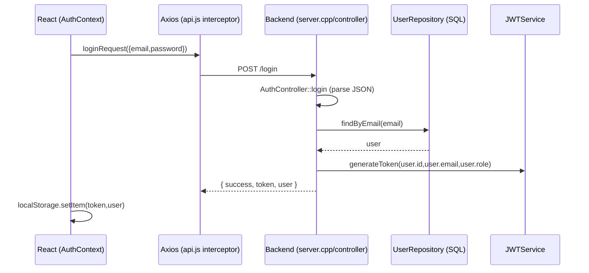

# 🧩 HelpDesk — Full Stack (C++ REST + React/Vite + MySQL)

[](#)
[](#)
[](#)
[](#)

> Documentação baseada **exclusivamente** no código presente no repositório.

---

## Visão geral
O projeto implementa um HelpDesk com:
- **Backend em C++** (server HTTP, controllers/services/repositories)
- **Frontend em React/Vite** consumindo a API via **Axios**
- **MySQL/MariaDB** acessado via **C-API** (`mysql_*`, `MYSQL*`, `mysql_query`, `mysql_stmt_*`)

### O que existe hoje (funcionalidades reais)
- ✅ Autenticação:
  - `POST /login`, `POST /register`
  - `POST /forgot-password`, `POST /reset-password`
  - token gerado/validado no backend via `JWTService` e `JWTMiddleware`
- ✅ Chamados/Tickets:
  - `POST /tickets` (JWT)
  - `PUT /tickets/:id` (atualiza status)
  - `DELETE /tickets/:id`
  - listagens e histórico por usuário
- ✅ Admin:
  - endpoints de fila, histórico global e prioridades

---

## Tabela de tecnologias
| Camada | Tecnologia | Evidência no código |
|---|---|---|
| Backend | C++17/17 | `backend/src/*` |
| HTTP | cpp-httplib | `#include "httplib.h"` e uso em `backend/src/server.cpp` |
| JSON | nlohmann/json | `backend/src/controllers/*` |
| Auth | JWT simplificado (interno) | `backend/src/core/server/JWTService.cpp`, `backend/src/core/middleware/JWTMiddleware.cpp` |
| Middlewares | JWTMiddleware + AuthMiddleware (placeholder) | `backend/src/core/middleware/*` |
| DB | MySQL/MariaDB C-API | `backend/src/repositories/*` |
| Frontend | React + Vite | `frontend/dashboard/*` |
| HTTP Client | Axios | `frontend/dashboard/src/services/api.js` |
| Sessão | localStorage | `frontend/dashboard/src/context/AuthContext.jsx` |
| Roteamento | react-router-dom | `frontend/dashboard/src/App.jsx` |

---

## Estrutura de pastas (mapa real)
### Backend
- `backend/src/server.cpp` — roteador principal (setup de rotas)
- `backend/src/controllers/*` — handlers de endpoints
- `backend/src/services/*` — regras de negócio (AuthService/TicketService)
- `backend/src/repositories/*` — persistência SQL (UserRepository/TicketRepository)
- `backend/src/core/middleware/*` — JWT/Auth/Role middleware
- `backend/src/core/server/JWTService.cpp` — token/parse
- `backend/include/structures/*` — estruturas de dados customizadas (fila/pilha/lista/ABB/ordenação)

### Frontend (dashboard)
- `frontend/dashboard/src/App.jsx` — rotas públicas/privadas/admin
- `frontend/dashboard/src/context/AuthContext.jsx` — login/logout e restauração de sessão
- `frontend/dashboard/src/services/api.js` — axios instance + interceptors
- `frontend/dashboard/src/services/authService.js` — wrappers de endpoints
- `frontend/dashboard/src/pages/*` — UI
- `frontend/dashboard/src/routes/*` — `PrivateRoute`, `AdminRoute`

---

## Arquitetura (MVC + Services + Repositories)
```mermaid
flowchart LR
  UI[React UI (pages/components)] -->|Axios HTTP + Authorization: Bearer| API[Backend HTTP Server (httplib)]
  API -->|Controller| C[Controllers]
  C -->|calls| S[Services]
  S -->|calls| R[Repositories]
  R -->|SQL| DB[(MySQL/MariaDB)]

  subgraph Auth
    S --> JWT[JWTService]
    CI[JWTMiddleware] -->|authenticate| C
  end
```

---

## Fluxo completo: Frontend → API → Backend → MySQL

### Login/JWT


### Abrir ticket e vínculo `user_id`
- Frontend envia `POST /tickets` com **Authorization** via interceptor
- Backend autentica com `JWTMiddleware::authenticate(req,payload)`
- O `userId` vem do payload e é passado para `TicketService::createTicket(..., payload.userId)`
- `TicketRepository::create(..., userId)` persiste `user_id` no banco

---

## Autenticação JWT + segurança
### JWTService (como o token funciona no seu código)
- Token gerado em `backend/src/core/server/JWTService.cpp` como:
  - `jwt|userId|email|role`

### JWTMiddleware (validação real)
- `backend/src/core/middleware/JWTMiddleware.cpp`
  - extrai `Authorization: Bearer <token>`
  - faz `JWTService::validateToken(token,payload)`

### Axios interceptors (frontend)
- `frontend/dashboard/src/services/api.js`
  - injeta `Authorization: Bearer ${localStorage.getItem('token')}`
  - em `401` limpa localStorage e redireciona para `/login`

### Middlewares adicionais
- `AuthMiddleware.cpp` existe mas é **placeholder** (valida só token não-vazio/tamanho)
- `RoleMiddleware.cpp` valida `payload.role` após validação do JWT

---

## Endpoints REST (rotas reais)
**Base:** endpoints configurados em `backend/src/server.cpp`

### Auth
| Método | Endpoint | Descrição |
|---|---|---|
| POST | `/register` | registro |
| POST | `/login` | login + token |
| POST | `/forgot-password` | gera token reset (email simulado via console) |
| POST | `/reset-password` | redefine senha por `token` |

### Tickets (usuário)
| Método | Endpoint | JWT |
|---|---|---|
| GET | `/tickets` | lista (ativos não-resolvidos) |
| GET | `/tickets/me` | **sim** |
| GET | `/tickets/history` | **sim** |
| POST | `/tickets` | **sim** |
| PUT | `/tickets/:id` | (atualiza status) |
| DELETE | `/tickets/:id` | remove |

### Admin
| Método | Endpoint | Descrição |
|---|---|---|
| GET | `/admin/tickets` | listagem |
| GET | `/admin/fila` | fila de atendimento |
| GET | `/admin/historico` | histórico global |
| GET | `/admin/prioridades` | ranking por prioridade |
| PUT | `/admin/tickets/:id` | atualiza status |

---

## Estruturas de dados: onde foram aplicadas
Baseado em `backend/src/services/TicketService.cpp` e `backend/include/structures/*`.

| Estrutura | Implementação | Uso no código |
|---|---|---|
| Fila | `FilaTickets` (queue) | `createTicket()` adiciona em `filaAtendimento`; `processNextTicket()` remove/proximo |
| Pilha | `PilhaTickets` (stack) | `updateTicketStatus()` em `status=="resolvido"` adiciona em `pilhaReabertura`; `reopenLastTicket()` |
| Lista Dupla | `ListaDupla` | histórico em memória: `historico.adicionar(t)` |
| ABB | `ABB` | inserção por `priority`: `arvorePrioridade.inserir(t)` |
| Ordenação | `stable_sort` e/ou `Ordenacao` | `getTicketsByPriority()` ordena por rank de prioridade |

---

## Dashboard admin (o que o código sustenta)
O frontend tem rotas admin protegidas por `AdminRoute`:
- `frontend/dashboard/src/routes/AdminRoute.jsx` valida `user.role === 'admin'`.

Admin usa endpoints de:
- fila (`GET /admin/fila`)
- histórico (`GET /admin/historico`)
- prioridades (`GET /admin/prioridades`)

---

## Problemas conhecidos / refatorações futuras (coerentes com o código)
1. **Rotas stub**
   - `backend/src/routes/TicketRoutes.cpp` e `backend/src/routes/AdminRoutes.cpp` retornam dados fake.
   - Fluxo principal usa `backend/src/server.cpp`.
2. **Inconsistência payload frontend ↔ backend**
   - `frontend/dashboard/src/pages/Tickets.jsx` envia `category` e `userId`.
   - O backend real `TicketController::createTicket()` exige `title`, `description`, `priority` e pega `userId` via JWT.
3. **AuthMiddleware placeholder**
   - `AuthMiddleware` não valida JWT real (placebo), enquanto o sistema de tickets usa `JWTMiddleware`.

---

## Roadmap futuro (baseado nos TODOs do repo)
- Unificar JWT/middlewares (remover placeholders)
- Alinhar contratos DTOs frontend ↔ backend
- Consolidar roteamento (remover stubs `backend/src/routes/*`)
- Melhorias de segurança (hash de senha, SQL mais seguro)

---

## Skills demonstradas
- Arquitetura Full Stack (React + C++ REST)
- Autenticação via JWT (token parsing e middleware)
- Persistência MySQL com prepared statements (em partes)
- Uso de estruturas de dados (fila/pilha/lista/ABB)
- Ordenação e motores em memória no service layer

---

## Aprendizados
- Separação clara entre Controller → Service → Repository
- Importância de contratos consistentes entre frontend e backend
- Riscos de SQL concatenado e necessidade de prepared statements consistentes

---

## Autor
**Cleyton Silva** — Full Stack (C++/React/MySQL)

---

## Screenshots (placeholders)
Os caminhos abaixo já estão prontos para inclusão posterior (sem imagens agora):
- `screenshots/login.png`
- `screenshots/dashboard.png`
- `screenshots/tickets.png`
- `screenshots/mytickets.png`
- `screenshots/history.png`
- `screenshots/admin.png`
- `screenshots/demo.gif`

